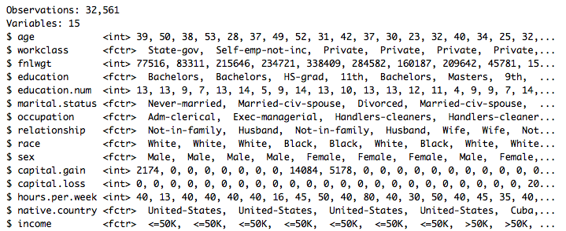
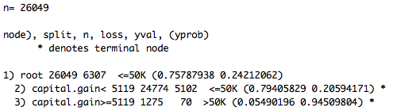
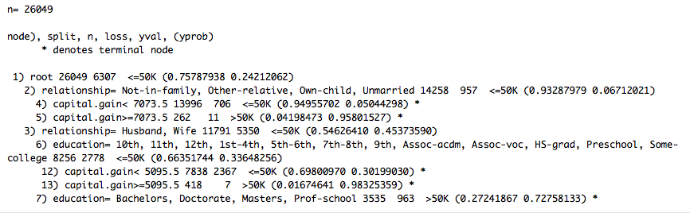

```{r message=FALSE, echo=FALSE}
#install.packages("caret")
#install.packages("gee")
#install.packages("ROCR")
require(mosaic)
library(mosaic)
library(class)
library(mosaicData)
library(gee)
library(quantreg)
library(nlme)
library(lme4)
library(mdsr)
library(class)
library(caret) #loads varImp function 
library(rpart) #defining decision trees
library(partykit) #plot decision tree
library(ROCR) #plots ROC curve
library(randomForest) 
library(ROCR) #plots ROC curve 
library(randomForest)
options(digits=3)
trellis.par.set(theme=theme.mosaic())
```

# Machine Learning Overview
- Ability to process raw data like speech, text and images 
- Develop pattern-recognition, image identification and reinforcement learning models
- Facilitate speech transcription through natural language processing (NLP)
- Identify data anomalies and create user-targetted recommendation systems

# Supervised Learning
- Modeling a response variable as a function of explanatory variables
- Data contains measurements of outcome variables (whether or not someone has diabetes) 
    - Regression
    - Nearest Neighbor
    - Decision Trees
    - Random Forests 
    - Naive Bayes
    - Artificial Neural Networks 
    - Ensemble Learning Models

# Unsupervised Learning
- Finding patterns or groupings with the absence of a clear response variable
- Unmeasured outcome (assembling DNA data into an evolutionary tree)
  - Clustering (k-means, hierarchical clustering)
  - Anomaly Detection
  - Hidden Markov Models
  
# Supervised Learning Workflow
- Partition data in training and test Sets
- Fit model (regression, decision trees, ensemble models)
- Assess model predictions through accuracy, ROC curves and k-fold cross-validation 
  
# Predict High Earners (>$50,000)
```{r}
census <- read.csv(
  "http://archive.ics.uci.edu/ml/machine-learning-databases/adult/adult.data", header = FALSE
)
names(census) <- c("age", "workclass", "fnlwgt",
                   "education", "education.num", 
                   "marital.status", "occupation", 
                   "relationship", "race", "sex", 
                   "capital.gain", "capital.loss",
                   "hours.per.week", "native.country",
                   "income")
```

# Data Glimpse
```{r, eval = FALSE}
glimpse(census)
```
 

#Partitioning Training and Test Sets 
```{r}
set.seed(164)
n <- nrow(census)
test <- sample.int(n, size = round(0.2 * n))
train <- census[-test, ]
test <- census[test, ]
tally(~income, data = train, format = "percent")
```


#Logistic Regression 
```{r}
logmod <- glm(income ~  age + workclass + education +
                marital.status + occupation + 
                relationship + race + sex + 
                capital.loss + hours.per.week,
                data = train, family=binomial(link='logit'))
```

#Variable Importance
```{r, eval = FALSE}
varImp(logmod)
```

```{r fig.width=4, fig.height=6,echo=FALSE}
library(png)
library(grid)
img <- readPNG("VarImpLog.png")
grid.raster(img)
```

#Confusion Matrix
```{r, message = FALSE, warning = FALSE}
pred <- predict(logmod, newdata=test, type = "response")
accuracy <- table(test[,"income"], pred > .5)
sum(diag(accuracy))/sum(accuracy)
```

#K-Nearest Neighbors (KNN)
- "Lazy Learners"
- Predict outcomes without constructing a model 

#The idea 
- A dataset with $p$ attributes (explanatory variables)
- Use Euclidean distance as the metric  
- Observations that are *close* to each other probably have similar outcomes


#Steps
- Find the $k$ observations in the training set closest to $x^\ast$
- Aggregate function $f$, calculate $y^\ast = f(y)$ using the $k$ observations. $y^\ast$ is the predicted value (that comes directly from the $k$ observations in the training set)
- No need to process the training data before making new classifications!

#Example
`knn()` in package `class`

```{r}
trainX <- train %>%
  select(age, education.num,capital.gain, capital.loss, hours.per.week)
trainY <- train$income
incomeknn <- knn(trainX, test=trainX, cl=trainY, k = 10)
confusion <- tally(incomeknn~trainY, format="count")
confusion
```

#Calculating accuracy 
```{r}
sum(diag(confusion))/nrow(train)
```

#Observing changes with different k
```{r}
knn_error_rate <- function(x,y, numNeighbors, z=x){
  y_hat <- knn(train =x, test=z, cl=y, k=numNeighbors)
  return(sum(y_hat!=y)/nrow(x))
}
ks <- c(1:15,20,30,40,50)
train_rate <- sapply(ks, FUN=knn_error_rate, x=trainX, y=trainY)
knn_error_rates <- data.frame(k=ks, train_rates=train_rate)
```

#Plotting results 
```{r}
ggplot(data=knn_error_rates, aes(x=k,y=train_rate))+geom_point()+geom_line()+ylab("misclassification rate")
```


#Decision Trees
- Assigns class labels to individual observations where each branch of tree separates data records in more pure class labels through recursive partitioning
- Use Gini coefficient and information gain as the purity criteria 

#Decision Tree Model 
```{r}
mod_treeCap <- rpart(income ~ capital.gain, data = train)
```
 

#Decision Tree Model Cont.
```{r}
form <- as.formula("income ~ age + workclass +
                    education + marital.status +
                    occupation + relationship + 
                    race + sex + capital.gain + 
                    capital.loss + hours.per.week")
mod_tree <- rpart(form, data = train)
```
 

#Plotting Decision Tree 
```{r, eval = FALSE}
plot(as.party(mod_tree))
```

```{r, fig.width=5, fig.height=8,echo=FALSE}
library(png)
library(grid)
img <- readPNG("DecisionTree.png")
grid.raster(img)
```

#Variable Importance
```{r, eval = FALSE}
varImp(mod_tree)
```

```{r, fig.width=5, fig.height=7,echo=FALSE}
library(png)
library(grid)
img <- readPNG("VarImpDecision.png")
grid.raster(img)
```

#Calculating Model Accuracy 
```{r}
pred <- predict(mod_tree, test, type = "class")
conf <- table(test$income, pred)
sum(diag(conf))/sum(conf) #accuracy 
```

#ROC Curve
- Receiver Operating Curve (ROC) considers all possible thresholds to predict the number of high-earners (>50K)
- Shows trade-off between sensitivity (true positive rate: TPR) and specificity (true negative rate: TNR)

#Plotting the ROC Curve
```{r}
income_prob <- predict(mod_tree, newdata=test, type="prob")
perf <- prediction(income_prob[, 2], test$income) 
perf <- performance(perf, measure = "tpr",
                    x.measure = "fpr")
```

#ROC Curve 
```{r, eval = FALSE}
plot(perf)
```

```{r fig.width=6, fig.height=7,echo=FALSE}
library(png)
library(grid)
img <- readPNG("ROCCurve.png")
grid.raster(img)
```

#Random Forest
- Collection of aggregated decision trees 
- Constructed process entails:
    - Choosing the number of decision trees (ntree) and number of variables to consider in each tree (mtry)
    - Randomly select data rows with replacement
    - Randomly select mtry variables
    - Build decision tree on resulting data
    - Repeat process ntree times 
    
#Random Forest Model 
```{r}
mod_forest <- randomForest(formula = form, data = train,
                           ntrain = 201, mtry = 3)
```

```{r fig.width=5, fig.height=5,echo=FALSE}
library(png)
library(grid)
img <- readPNG("RandomMod.png")
grid.raster(img)
```

#Model Accuracy
```{r}
sum(diag(mod_forest$confusion))/nrow(train)
```

#Variable Importance
```{r, eval = FALSE}
importance(mod_forest) %>%
  as.data.frame() %>%
  tibble::rownames_to_column() %>%
  arrange(desc(MeanDecreaseGini))
```

```{r fig.width=3, fig.height=5,echo=FALSE}
library(png)
library(grid)
img <- readPNG("VarImpForest.png")
grid.raster(img)
```

#Variable Importance Plot
```{r}
varImpPlot(mod_forest, type = 2)
```

#Clustering 
```{r}
library(ape)
library(mclust)

WorldCities <- WorldCities %>%
  arrange(desc(population)) %>%
  select(longitude, latitude)

city_clusts <- WorldCities %>%
  kmeans(centers = 6) %>%
  fitted("classes") %>%
  as.character()

WorldCities <- WorldCities %>% mutate(cluster = city_clusts)
```

```{r}
WorldCities %>% ggplot(aes(x = longitude, y = latitude)) +
  geom_point(aes(color = cluster), alpha = 0.5)
```
